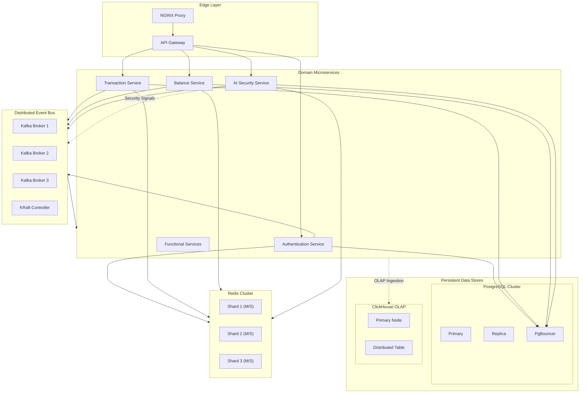

# Distributed Microservice Payment Gateway

The Distributed Microservice Payment Gateway is a high-performance financial orchestration platform designed for extreme reliability, horizontal scalability, and real-time observability. The architecture has transitioned from a modular monolith to a decentralized ecosystem of specialized microservices.

## System Architecture and Topology

The infrastructure follows a Cloud-Native N-Tier Architecture, where every functional domain is isolated for fault tolerance and independent lifecycle management.

### Service Orchestration Map

The following Mermaid diagram illustrates the request lifecycle and inter-service communication paths:



## Technical Specifications

| Component | Implementation | Documentation Reference |
| :--- | :--- | :--- |
| Application Core | Go v1.25+ / Python v3.12+ | [ARCHITECTURE.md](./ARCHITECTURE.md) |
| Communication | gRPC / Protobuf v3 | [PROTO_SYSTEM.md](./proto/README.md) |
| Event Streaming | Apache Kafka (KRaft Mode) | [MESSAGING.md](./deployments/messaging/README.md) |
| OLTP Storage | PostgreSQL 17-alpine | [DATABASE.md](./pkg/database/README.md) |
| OLAP Storage | ClickHouse 24.3+ | [ANALYTICS.md](./service/stats-reader/README.md) |
| Cache Layer | Redis Cluster (6-node) | [CACHE_STRATEGY.md](./shared/cache/README.md) |
| Observability | OTEL / Loki / Prometheus | [OBSERVABILITY.md](./observability/README.md) |

## Core Functional Domains

### Identity and Access Management
The Authentication and User services implement a stateless JWS/JWT architecture. All authorization decisions are strictly RBAC-governed and cached within the Redis Cluster to minimize database load.

### Transactional Engine
The core transactional pipeline (Transaction, Topup, Withdraw, Transfer) utilizes event-sourcing principles. All state transitions are committed to PostgreSQL and simultaneously emitted to the Distributed Event Bus for downstream processing.

### Artificial Intelligence Security
A Python-based AI Security service provides real-time fraud detection. Every high-risk transaction is intercepted by the Decision Authority using behavioral analysis and probabilistic risk scoring.

### Real-Time Analytics
Aggregated telemetry and transaction statistics are offloaded to ClickHouse. The Stats-Reader service provides sub-second execution times for complex historical queries over large-scale datasets.

## Deployment and Orchestration

### Development Environment (Containerized)
Local development is managed via Justfile to ensure build reproducibility:

```bash
# Initialize images and start orchestration
just build-up

# Execute database migrations and seed high-fidelity data
just migrate
just seeder
```

### Production Environment (Kubernetes)
The platform is optimized for Kubernetes deployment using Helm-compatible manifests. It utilizes StatefulSets for persistence layers and Horizontal Pod Autoscalers (HPA) for compute-intensive microservices.

## Monitoring and Observability

Standardized OpenTelemetry (OTEL) instrumentation is implemented across all services. Unified logs are ingested into Grafana Loki, while metrics are scraped by Prometheus for real-time alerting.

---

2026 MamangRust Engineering Group. Enterprise Financial Infrastructure.